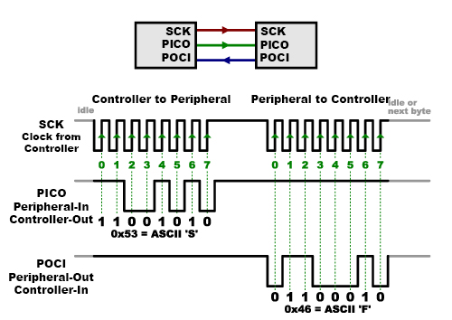
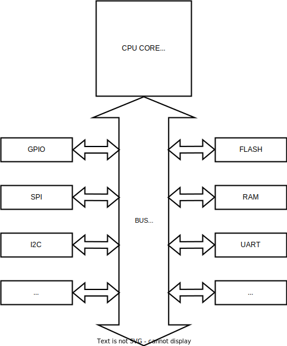
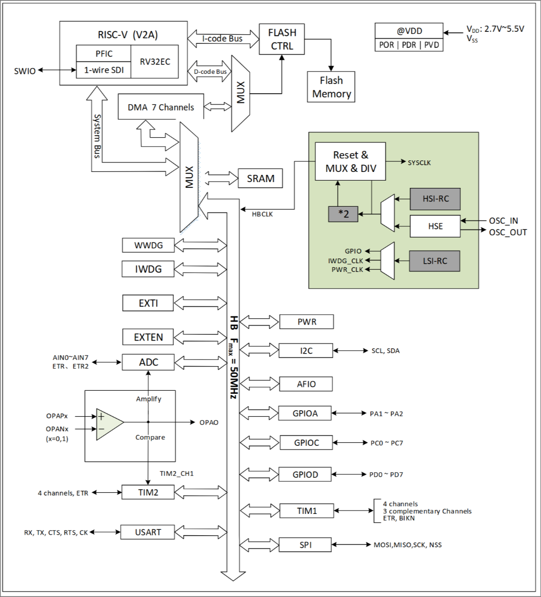
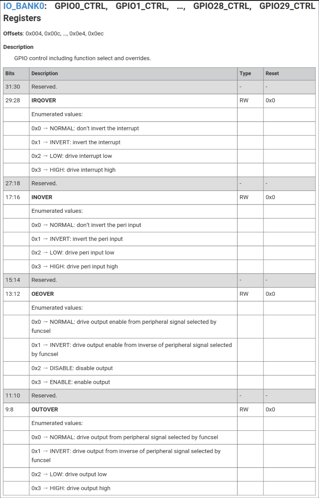
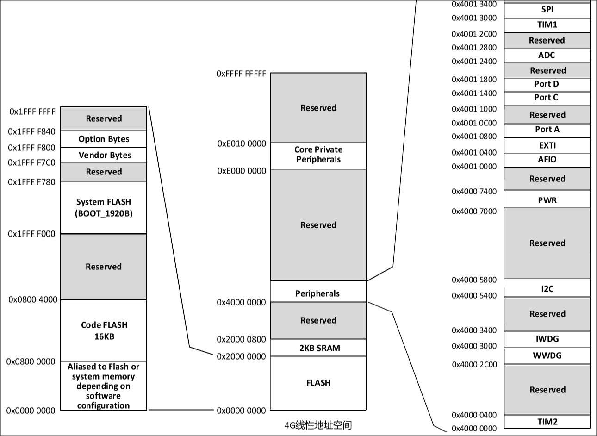

# <!--fit--> PV281: Programování v Rustu

---

# Obsah

1. Úvod do Embedded
2. no_std
3. Kompilace pro embedded
4. probe-rs
5. PAC, HAL a embedded-hal
6. embassy a RTIC
7. defmt
8. heapless
9. postcard

---

# Úvod do Embedded 

U embedded programování se bavíme od 8-bitových mikrokontrolérů s pár kilobajty RAM až po systémy s Gigabajty jako Raspberry Pi.

Výhradně se bavíme o "bare-metal", tj. váš program je jediné co běží na daném čipu.

Nemáme žádnou kontrolu paměti kterou si explicitně nenastavíme v hardwaru. (pokud je to vůbec podporováno)
Nemáme knihovny a ovládání periférii které nám dodává operační systém.

---

## Periférie

Dá se říct že mikrokontrolér se skládá z několika částí.

Processorové jádro - počítá a nastavuje.

Periférie - dovolují interagovat s okolím světem ve formě přepínání pinů (GPIO, SPI, I2C, USB...)
a pomáhá processorovému jádru v počítání (CRC32, přerušení, časovače...).

Sběrnice - propojuje tyto části dohromady aby si processor myslel že je všechno v jeho adresním prostoru.

---

## SPI



---

## Základní model



---

## Příklad modelu (CH32v003)



---

## Příklad ovládacího registru



---

## Vývojový model

Na "plných" operačních systémech je jasně dáno jak má binární program vypadat. (.exe, .elf)

V embedded to nevíme, u každého čipu může program začínat jinde, může mít RAM jinde atd.

Proto potřebujeme linker script.

---

### Linker script pro Rust program

```
MEMORY
{.
  RAM : ORIGIN = 0x2000, LENGTH = 8K
  FLASH : ORIGIN = 0x0000, LENGTH = 8K
}

REGION_ALIAS("REGION_TEXT", FLASH);
REGION_ALIAS("REGION_RODATA", FLASH);
REGION_ALIAS("REGION_DATA", RAM);
REGION_ALIAS("REGION_BSS", RAM);
REGION_ALIAS("REGION_HEAP", RAM);
REGION_ALIAS("REGION_STACK", RAM);
```

---

## Debugování embedded systémů

Na PC běží program (OpenOCD/probe-rs) který předstírá že je debugovaný program.

GDB/LLDB si tak myslí že debuguje normální program.

OpenOCD či probe-rs však jen překládá debug příkazy z GDB/LLDB dál.

---

### Debugování embedded systémů - příklad


---

## Embedded v C/C++

Instalovat si všechny dependence pro vývoj je pro běžného vývojáře těžké. Obzvláště v C++.

Výrobci mají vlastní IDE kde si všechno řeší sami. Dovoluje to i jednodušší konfiguraci.

Není na první pohled zřejmé jaké části standardní knihovny jsou či nejsou bezpečné pro embedded.
To stejné platí i pro většinu externích knihoven.

Není sjednocený build systém, můžete být rádi když výrobce je schopen generovat projekty se CMake.

---

## Mapování ovládacích registru

Ovládací registr = registr který ovládá nějaký aspekt processoru. To je posílání dat, zapínání/vypínání/čtení pinů,
spací režimy, konfigurace periférií...

Registry jsou přímo mapovány do paměti. Jako kdyby to byla RAM.

Když šáhneme na neplatnou paměť, v lepším případě dostaneme chybu dekódování adresy,
v horším jsme si něco špatně nastavili.

---

## Mapování ovládacích registru - příklad



---

## Nastavení registrů přes nekontrolovaný přístup do adresního prostoru

```rust
fn main() {
    let mut ptr = 0x40014004usize as *mut u32;
    let enable_output = 0x3 << 12; // Enable output, všechny ostatní bity na nule
    unsafe { ptr.write_volatile(enable_output); }
}
```

Velmi málokdy je třeba, většinou jsme schopni si vygenerovat vrstvu "PAC" z dat co dodává vyrobce.

---

# no_std

`std` knihovna v Rustu vyžaduje systémová volání od operačního systému pro řadu funkcionalit.

tj. operování se soubory, sockety, operování s vlákny, operování se vstupem/výstupem, atd.

Knihovnu či aplikaci která nevyužívá standardní knihovny označíme pomocí `#![no_std]`

U knihoven které podporují `no_std` si většinou musíte zapnout flag pro to.

---

## core

Core knihovna v Rustu obsahuje funkcionalitu z `std` která nevyžaduje dependence či alokace.

Stále máte iterátory, `Option`, `Result`, `Error` (od 1.81), statická pole, `Future`...

Kolekce nejsou k dispozici, ty jsou v knihovně `alloc`.

---

## alloc

Je třeba si nakonfigurovat alokátor aby šla používat `alloc` knihovna.

V embedded se díky malému množství RAM a díky tomu že nemáme hardwarovou správu paměti snažíme nepotřebným alokacím vyhýbat.

S dynamickou alokací je těžké předem předpovídat kolik paměti bude program potřebovat. Jen se statickou je to jednoduché.


---

# Kompilace a nahrání programu pro embedded

Je třeba mít schopnost kompilovat pro danou architekturu kterou máme.

Příkad, u RP2040:

```sh
 $ rustup target add thumbv6m-none-eabi
```

---

## Kompilace a nahrání programu pro embedded - pokračování

Na cviku budeme nahrávat přes zabudovaný bootloader, bude tedy třeba i:

```sh
 $ cargo install elf2uf2-rs --locked
```

---

## `.cargo/config.toml`

```toml
[target.'cfg(all(target_arch = "arm", target_os = "none"))']
runner = "elf2uf2-rs -d"
rustflags = [
  "-C", "linker=flip-link",
  "-C", "link-arg=--nmagic",
  "-C", "link-arg=-Tlink.x",
]

[build]
target = "thumbv6m-none-eabi"
```
---

# probe-rs

Software pro nahrávání a debugování embedded programů.

Má v sobě podporu pro `defmt` (více později)

Podporuje debug architektur ARM, Xtensa a RISC-V

Alternativa k OpenOCD.

Funguje i jako knihovna (narozdíl od OpenOCD).

---

## probe-rs - příklad

```rust
let mut session = Session::auto_attach(
    "RP2040",
    Permissions::default()
)?;

// Select a core.
let mut core = session.core(0)?;

// Read a block of 50 32 bit words.
let mut buff = [0u32; 50];
core.read_32(0x2000_0000, &mut buff)?;

// Writing is just as simple.
let buff = [0u32; 50];
core.write_32(0x2000_0000, &buff)?;
```

---

# PAC

Tzv. peripheral access crate, tj. knihovna pro přístup k registrům.

Výrobci procesorů obvykle dodávají XML soubor který dané registry popisuje.

Jsme schopni z něj generovat knihovnu pro přístup k registrům a modifikace jednotlivých bitů je jednodušší. (pomocí `svd2rust`)

Staví se na něm HAL, tj. hardware abstraction layer.

---

## PAC - příklad

```rust
let mut pac = pac::Peripherals::take().unwrap();
    
pac.IO_BANK0.gpio(0).gpio_ctrl()
    .modify(|w| w.oeover().enable());
```

V tomto případě se změní jen ty dva bity odpovídající `OUTOVER`.

---

# HAL

Přistupovat k jednotlivým bitům stále bolí a je to nečitelné.

K jendoduššímu přístupu máme knihovny které nám dávají větší abstrakci.

Výrobci dodávají HAL v C. Ty Rustové jsou obvykle dělané komunitou.

---

# HAL - příklad

```rust
let mut out_pin = pins.gpio25.into_push_pull_output();

let mut in_pin = pins.gpio23.into_pull_down_input();

loop {
    if in_pin.is_low().unwrap() {
        out_pin.set_high().unwrap();
    } else {
        out_pin.set_low().unwrap();
    }
}
```

---

# embedded-hal a jeho varianty

Pro potřeby sdílení knihoven existují rozhraní které popisují často sdílenou funkcionalitu mezi čipy.

tj. GPIO piny, SPI, I2C, CAN, UART...

Každý čip toto implementuje jinak, proto by měl HAL tyto `traits` implementovat pro danou periférii.

Knihovna pro obsluhování nějakého externího čipu tak může být jednoduše napsaná genericky.

---

## embedded-hal příklad

```rust
// Priklad SPI
let spi_mosi = pins.gpio7.into_function::<hal::gpio::FunctionSpi>();
let spi_miso = pins.gpio4.into_function::<hal::gpio::FunctionSpi>();
let spi_sclk = pins.gpio6.into_function::<hal::gpio::FunctionSpi>();
let spi = hal::spi::Spi::<_, _, _, 8>::new(pac.SPI0, (spi_mosi, spi_miso, spi_sclk));

// Spi perfiferie implementuje trait SpiBus
let mut spi = spi.init(
    &mut pac.RESETS,
    clocks.peripheral_clock.freq(),
    16.MHz(),
    embedded_hal::spi::MODE_0,
);

if spi.write(&[0]).is_ok() {
    // Success
};
```

---

# Embassy

Asynchronní runtime udělaný pro embedded.

V některých případech nám dovoluje nepoužít RTOS.

V případě že není co dělat, processor se uspí a čeká se na přerušení.

Narozdíl od `tokio` jsou `Future` v embedded světě univerzální, nezávisí na runtime.

---

<!-- _class: split -->

<div class=left-column>

```rust
#[embassy_executor::main]
async fn main(spawner: Spawner) {
// Initialize the embassy-rp HAL.
let p = embassy_rp::init(Default::default());

    // Spawned tasks run in the background, concurrently.
    spawner.spawn(blink(p.PIN_25.degrade())).unwrap();

    let mut button = Input::new(p.P0_11, Pull::Up);
    loop {
        // Asynchronously wait for GPIO events
        button.wait_for_low().await;
        info!("Button pressed!");
        button.wait_for_high().await;
        info!("Button released!");
    }
}
```

</div>
<div class=right-column>

```rust
// Declare async tasks
#[embassy_executor::task]
async fn blink(pin: AnyPin) {
    let mut led = Output::new(pin, Level::Low, OutputDrive::Standard);

    loop {
        // Timekeeping is globally available,
        // no need to mess with hardware timers.
        led.set_high();
        Timer::after_millis(150).await;
        led.set_low();
        Timer::after_millis(150).await;
    }
}
```

</div>

---

# RTIC

Chceme runtime/RTOS se striktními garancemi kdy proběhne náš kód.

Sami si řešíme přerušení.

Compile time plánování tasků.

Blíž k tradičním embedded projektům.

---

## RTIC - Příklad

<!-- _class: split -->

<div class=left-column>

```rust
#[shared]
struct Shared {}

#[local]
struct Local {
    led: PA5<Output<PushPull>>,
    state: bool,
}

#[init]
fn init(cx: init::Context) -> (Shared, Local) {
    // Clock setup omitted ...

    rtt_init_print!();
    rprintln!("init");

    // Setup LED
    let mut gpioa = cx.device.GPIOA.split(&mut rcc.ahb);
    let mut led = gpioa
        .pa5
        .into_push_pull_output(&mut gpioa.moder, &mut gpioa.otyper);
    led.set_high().unwrap();

    // Schedule the blinking task
    blink::spawn().ok();

    (Shared {}, Local { led, state: false })
}
```

</div>
<div class=right-column>

```rust
#[task(local = [led, state])]
async fn blink(cx: blink::Context) {
    loop {
        rprintln!("blink");
        if *cx.local.state {
            cx.local.led.set_high().unwrap();
            *cx.local.state = false;
        } else {
            cx.local.led.set_low().unwrap();
            *cx.local.state = true;
        }
        Mono::delay(1000.millis()).await;
    }
}
```

---

# defmt

Při logování musíme tradičně dávat celé řetězce do bináry. Na embedded chceme šetřit.

Místo celého řetězce jen tedy pošleme ID řetězce a případně hodnoty pro formátování.
Formátovácí řetězce necháme v `.elf` souboru a debugger si je přečte a formátuje za nás.

Je třeba nějak transportovat ID řetězců a hodnoty pro formátování.

```rust
defmt::error!("The answer is {=i16}!", 300); // [3, 44, 1]
```

---

## defmt - pokračování

Otázka je jak transportovat tyto data z embedded čipu na PC, je několik možností.

`defmt-rtt` - Vyhradí se část RAM kterou si za běhu bude debugger číst. Hardware to musí podporovat.

`defmt-itm` - Hardware loguje přes speciální periférii pro to určenou, jen u některých ARM čipů.

`defmt-semihosting` - Hardware se zastaví a čeká než si to debugger nepřečte, nedoporučeno.

`defmt-bbq` - Loguje se do interního bufferu, "vyřeším si to sám"

---

# Heapless

Knihovna pro statické struktury, vhodné pro embedded.

Častokrát potřebujeme pro čistotu kódu rozhraní vektoru nebo hašovací tabulky,
`heapless` nám ho dá, za cenu že musíme předem říct kolik místa maximálně potřebujeme.

Data tak jdou na zásobník, ne na haldu.

---

## Heapless - příklad

```rust
let mut vec = Vec::<_, 8>::new();
vec.push(1);
vec.push(2);

assert_eq!(vec.len(), 2);
assert_eq!(vec[0], 1);

assert_eq!(vec.pop(), Some(2));
assert_eq!(vec.len(), 1);
```

---

# Postcard

Embedded serializer a deserializer pro `serde`.

Důraz na šetření zdrojů, i při prenosu dat.

Dovoluje vám sdílet struktury mezi host počítačem a embedded čipem.

Součástí je i parsování dat a překlad z bitového streamu na struktury. (`postcard::accumulator::CobsAccumulator`)

---

## Postcard - příklad

```rust
#[derive(Serialize, Deserialize, Debug, Eq, PartialEq)]
struct RefStruct<'a> {
    bytes: &'a [u8],
    str_s: &'a str,
}
let message = "hElLo";
let bytes = [0x01, 0x10, 0x02, 0x20];
let output: Vec<u8, 11> = to_vec(&RefStruct {
    bytes: &bytes,
    str_s: message,
}).unwrap();
```

---

# <!--fit--> Dotazy?

---

# <!--fit--> Děkuji za pozornost

