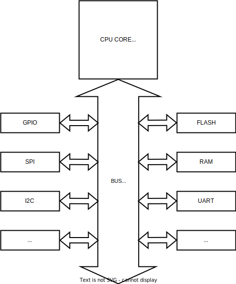
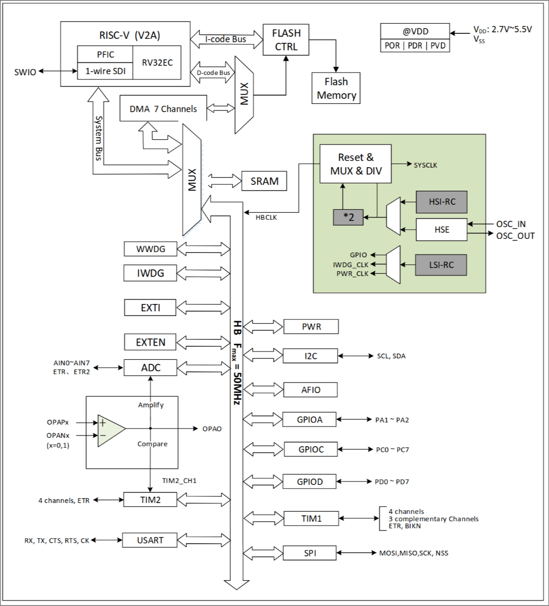
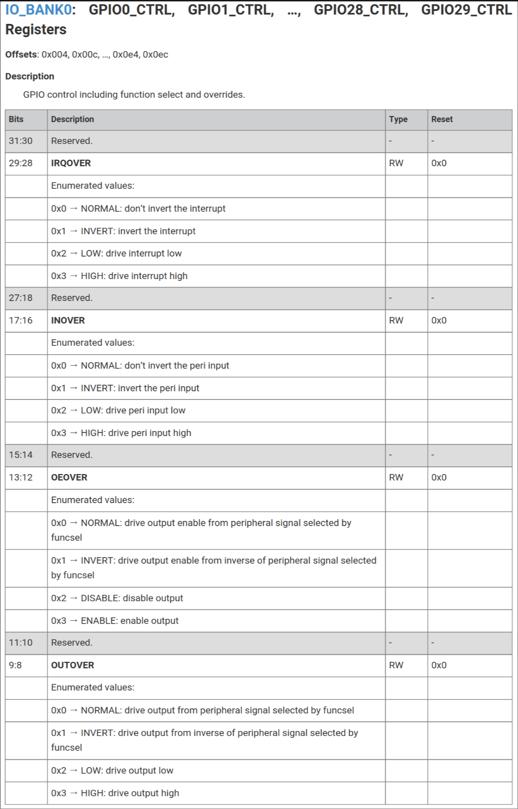
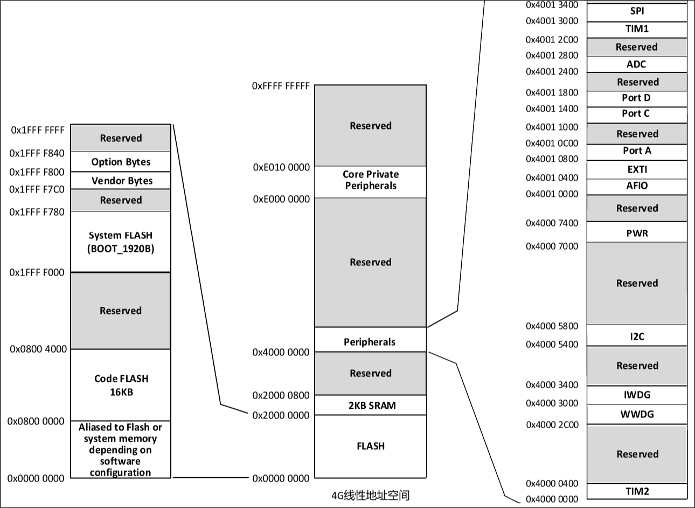

# <!--fit--> PV281: Programování v Rustu

---

# Obsah

1. Úvod do Embedded
2. PAC a HAL
3. no_std
4. Kompilace pro embedded
5. embassy
6. postcard

---

# Úvod do Embedded 

U embedded programování se bavíme od 8-bitových mikrokontrolérů s pár kilobajty RAM až po systémy s Gigabajty jako Raspberry Pi.

Výhradně se bavíme o "bare-metal", tj. váš program je jediné co běží na daném čipu.

Nemáme žádnou kontrolu paměti kterou si explicitně nenastavíme v hardwaru. (pokud je to vůbec podporováno)

Nemáme knihovny a ovládání periférii které nám dodává operační systém.

V Rustu nemáme `std` knihovnu a všechny knihovny které ji potřebují.

Častokrát ovládáme jednotlivé bity v ovládacích registrech.

---

## Základní model



---

## Příklad modelu (CH32v003)



---

## Příklad ovládacího registru



---

## Vývojový model

Na "plných" operačních systémech je jasně dáno jak má binární program.

V embedded to nevíme, u každého čipu může program začínat jinde, může mít RAM jinde atd.

Proto potřebujeme linker script.

TODO: Přidat sekci co je třeba pro instalaci toolchainu

```
MEMORY
{
  RAM : ORIGIN = 0x2000, LENGTH = 8K
  FLASH : ORIGIN = 0x0000, LENGTH = 8K
}

REGION_ALIAS("REGION_TEXT", FLASH);
REGION_ALIAS("REGION_RODATA", FLASH);
REGION_ALIAS("REGION_DATA", RAM);
REGION_ALIAS("REGION_BSS", RAM);
REGION_ALIAS("REGION_HEAP", RAM);
REGION_ALIAS("REGION_STACK", RAM);
```

---

## Debugování embedded systémů

Na PC běží program (OpenOCD/probe-rs) který předstírá že je debugovaný program.

GDB/LLDB si tak myslí že debuguje normální program.

OpenOCD či probe-rs však jen překládá debug příkazy z GDB/LLDB dál.


Na cviku toto nebude, budete používat bootloader přímo na čipu.

---

## Mapování ovládacích registru

Ovládací registr = registr který ovládá nějaký aspekt processoru. To je posílání dat, zapínání/vypínání/čtení pinů,
spací režimy, konfigurace periférií...

Registry jsou přímo mapovány do paměťi. Jako kdyby to byla RAM.

Když šáhneme na neplatnou paměť, v lepším případě dostaneme chybu dekódování adresy,
v horším jsme si něco špatně nastavili.



---

## Nastavení registrů přes nekontrolovaný přístup do adresního prostoru

```rust
fn main() {
    let mut ptr = 0x40014004usize as *mut u32;
    let enable_output = 0x3 << 12; // Enable output, všechny ostatní bity na nule
    unsafe { ptr.write_volatile(enable_output); }
}
```

Velmi málokdy je třeba, většinou jsme schopni si vygenerovat vrstvu "PAC" z dat co dodává vyrobce.

---

# PAC

Tzv. peripheral access crate, tj. knihovna pro přístup k registrům.

Výrobci procesorů obvykle dodávají XML soubor který dané registry popisuje.

Jsme schopni z něj generovat knihovnu pro přístup k registrům a modifikace jednotlivých bitů je jednodušší. (pomocí `svd2rust`)

Staví se na něm HAL, tj. hardware abstraction layer.

```rust
let mut pac = pac::Peripherals::take().unwrap();
    
pac.IO_BANK0.gpio(0).gpio_ctrl()
    .modify(|w| w.oeover().enable());
```

V tomto případě se změní jen ty dva bity odpovídající `OUTOVER`.

---

# HAL

Přistupovat k jednotlivým bitům stále bolí a je to nečitelné.

K jendoduššímu přístupu máme knihovny které nám dávají větší abstrakci.

Výrobci dodávají HAL v C. Ty Rustové jsou obvykle dělané komunitou.

```rust
let mut out_pin = pins.gpio25.into_push_pull_output();

let mut in_pin = pins.gpio23.into_pull_down_input();

loop {
    if in_pin.is_low().unwrap() {
        out_pin.set_high().unwrap();
    } else {
        out_pin.set_low().unwrap();
    }
}
```

---

## embedded-hal

Pro potřeby sdílení knihoven existují rozhraní které popisují často sdílenou funkcionalitu mezi čipy.

tj. GPIO piny, SPI sběrnice, I2C sběrnice, CAN, UART...

Každý čip toto implementuje jinak, proto by měl HAL tyto `traits` implementovat pro danou periférii.

```rust
// Priklad SPI
let spi_mosi = pins.gpio7.into_function::<hal::gpio::FunctionSpi>();
let spi_miso = pins.gpio4.into_function::<hal::gpio::FunctionSpi>();
let spi_sclk = pins.gpio6.into_function::<hal::gpio::FunctionSpi>();
let spi = hal::spi::Spi::<_, _, _, 8>::new(pac.SPI0, (spi_mosi, spi_miso, spi_sclk));

// Spi perfiferie implementuje trait SpiBus
let mut spi = spi.init(
    &mut pac.RESETS,
    clocks.peripheral_clock.freq(),
    16.MHz(),
    embedded_hal::spi::MODE_0,
);

if spi.write(&[0]).is_ok() {
    // Success
};
```

---

# no_std

`std` knihovna v Rustu vyžaduje systémová volání od operačního systému pro řadu funkcionalit.

tj. operování se soubory, sockety, operování s vlákny, operování se vstupem/výstupem, atd.

Knihovnu či aplikaci která nevyužívá standardní knihovny označíme pomocí `#![no_std]`

```rust
#![no_std]

fn main() -> ! {
    loop {
        
    }
}
```

---

## core

Core knihovna v Rustu obsahuje funkcionalitu z `std` která nevyžaduje dependence či alokace.

Stále máte iterátory, `Option`, `Result`, `Error` (od 1.81), statická pole, `Future`...

Kolekce nejsou k dispozici, ty jsou v knihovně `alloc`.

---

## alloc

Je třeba si nakonfigurovat alokátor aby šla používat `alloc` knihovna.

V embedded se díky malému množství RAM a díky tomu že nemáme hardwarovou správu paměťi snažíme nepotřebným alokacím vyhýbat.

S dynamickou alokací je těžké předem předpovídat kolik paměťi bude program potřebovat. Jen se statickou je to jednoduché.


# <!--fit--> Dotazy?

---

# <!--fit--> Děkuji za pozornost

